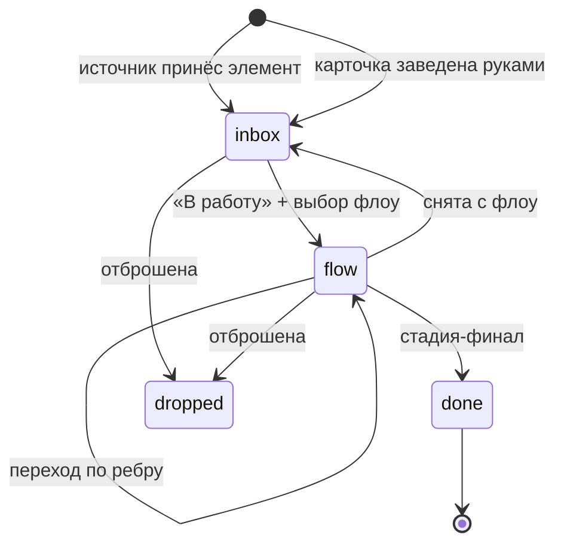
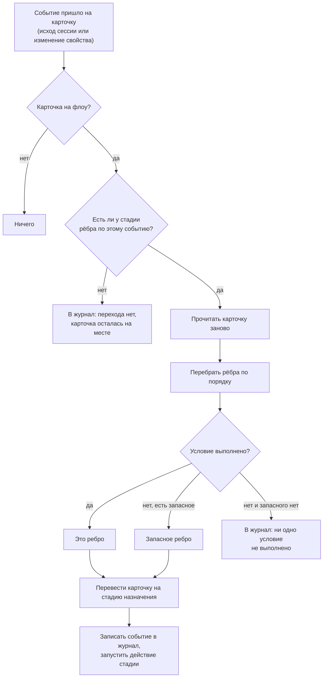
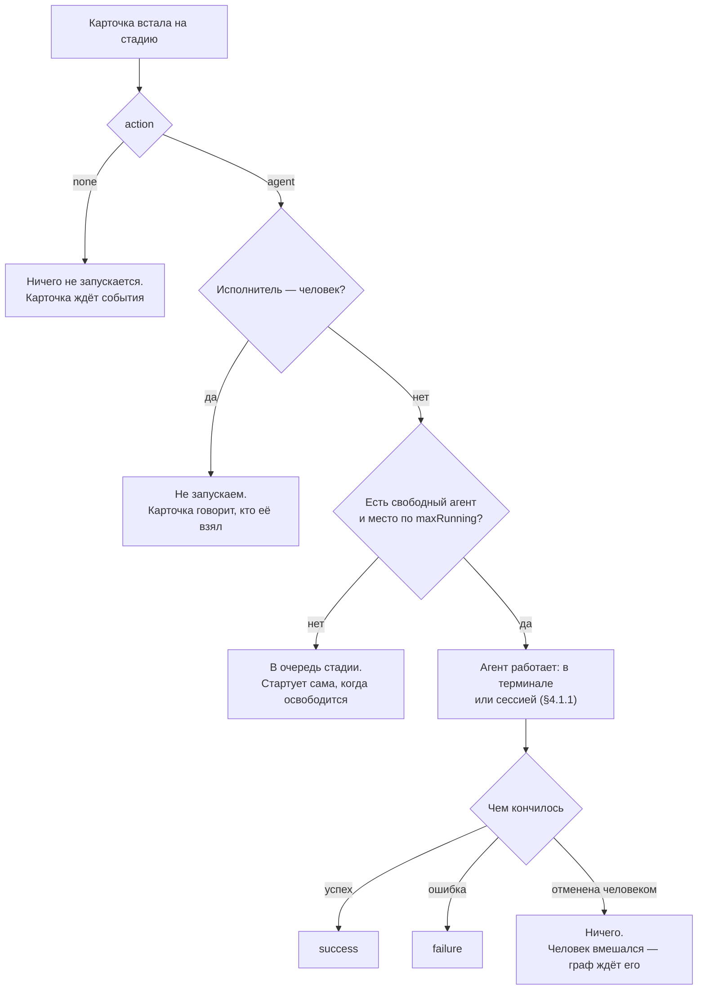

# Входящие → флоу

Формализация системы XXVI: как задача попадает в приложение, как она едет по
флоу, при каких условиях делается следующий шаг и какой агент подбирает её на
каждой стадии.

Документ написан до кода и остаётся местом, где записаны решения, а не
пересказом реализации. Смежный документ: [poc.md](poc.md) — что входит в первую
версию и что сознательно отложено.

## 1. Чем это отличается от XCIII

XCIII — это доска. Карточка живёт в колонке, колонка говорит, что с ней делать,
маршрут говорит, куда её двигать дальше. Три сущности на один вопрос: где
карточка, что с ней происходит и куда она поедет.

Здесь канбана нет. Остаются две вещи:

- **Входящие** — то, что принесли источники, сгруппированное по источникам;
- **Флоу** — маршрут, по которому едет взятая в работу карточка.

Из этого следует главное упрощение: **колонок нет, поведение переезжает на
стадию**. В XCIII стадия маршрута ссылалась на колонку доски, а колонка несла
действие, состав и лимит; там это было правильно, потому что доска существовала
и без маршрутов. Здесь стадия — единственное место, где карточка может стоять,
и разделять «где стоит» и «что делается» стало нечем. Стадия сама говорит, что
на ней происходит, кто её работает и сколько карточек одновременно.

Что остаётся из XCIII без изменений по смыслу: замкнутое множество триггеров,
условия на переходах (свойство карточки и слова агента), объявленные входы и
выходы стадии, служебное поле «Исход» с двумя значениями, очередь на занятую
стадию, сигналы HITL, агенты по ACP.

Выходы и входы переехали сюда без колонки: в XCIII их несла колонка, а стадия
маршрута перекрывала. Здесь перекрывать нечего — объявление одно, и оно на
стадии.

## 2. Словарь

| Термин | Что это |
|---|---|
| **Источник** (source) | откуда приходят задачи: демо-файл, ingest с телефона, трекер. Запись реестра |
| **Элемент** (item) | единица данных источника: одно письмо, одно уведомление, один issue |
| **Правило** (rule) | что сделать с элементом: завести карточку или отбросить |
| **Входящие** (inbox) | куда карточка попадает до решения человека. Не то же, что источник: источник приносит элементы сам, а входящие — место, где карточки ждут, откуда бы ни пришли |
| **Карточка** (card) | единица работы. Заводится из элемента или руками |
| **Флоу** (flow) | именованный граф стадий и переходов |
| **Стадия** (stage) | узел флоу. Место, где карточка стоит, и работа, которая на ней делается |
| **Переход** (edge) | ребро: из какой стадии, по какому событию, в какую стадию, при каком условии |
| **Триггер** (trigger) | событие перехода. Множество замкнуто и реализовано в Go |
| **Условие** (condition) | вопрос о карточке на ребре. Не скрипт |
| **Агент** (agent) | зарегистрированный ACP-агент: claude, codex или произвольная ACP-команда |
| **Состав** (crew) | агенты, которым разрешено работать эту стадию |
| **Сессия** (session) | один запуск агента по одной карточке на одной стадии |
| **Терминал агента** | pty, в котором работает собственный CLI агента: стадия, которую человек видит и в которую печатает |
| **Вопрос** (question) | агент спросил человека и ждёт ответа (HITL) |
| **Проект** (project) | место, где идёт работа: папка на этой машине. Запись реестра |
| **Лента** (ribbon) | одна карточка в работе, показанная как полоса экранов |
| **Экран** (screen) | одно окно внутри ленты: заметки, терминал, браузер |
| **Журнал** (journal) | аудит карточки: кто, что и когда с ней сделал. Пишется всегда, показывается, только когда его раскрыли. Запись журнала (entry) — то, что раньше называлось комментарием |

## 3. Жизнь карточки



Ровно четыре состояния: `inbox`, `flow`, `done`, `dropped`. Карточка в
состоянии `flow` всегда стоит на какой-то стадии — пары «на флоу, но нигде» не
существует, и это инвариант, а не соглашение.

Отбросить карточку можно и прямо с флоу, одним шагом: агент останавливается, и
карточка уходит. «Снять, потом отбросить» — это два решения там, где человек
принял одно, и лишний заход во входящие, где её никто не ждёт. Сделанную
карточку не отбрасывают: она сделана, и сказать иначе задним числом значит
переписать то, что было.

Вход во флоу — **решение человека**: во входящих у карточки есть кнопка «В
работу», она спрашивает флоу и ставит карточку на его входную стадию. Правила
источника могут заполнить свойства карточки, но не могут запустить её по флоу
сами: PoC сознательно оставляет этот шаг человеку, чтобы «почему эта карточка
поехала» всегда имело ответ.

## 4. Флоу

Флоу — это граф:

```
Flow  = { name, description, entryStage, stages[], edges[] }
Stage = { id, name, action, work, prompt, crew[], maxRunning, final,
          writes[], reads[], x, y }
Edge  = { from, to, on, if? }
PropertyWrite = { property, required }
```

**Входная стадия** — та, на которую карточка встаёт при «В работу». Она одна и
задаётся явно: граф с циклами не имеет естественного начала, а угадывать его по
отсутствию входящих рёбер значит ломать флоу первым же обратным переходом.

**Финальная стадия** (`final`) — та, после которой карточка становится `done`.
Она ничего не делает и никуда не ведёт.

### 4.1. Что делает стадия

Действие стадии — замкнутое множество:

| `action` | Что происходит, когда карточка встаёт на стадию |
|---|---|
| `none` | ничего. Карточка стоит и ждёт события — обычно ответа человека |
| `agent` | запускается сессия ACP-агента с задачей карточки |

Двух действий достаточно, и третье пришлось бы придумывать. `deploy` и `test`
из XCIII были не действиями, а агентами с предустановленным промптом и особыми
правами; здесь это просто стадии с `action: agent`, своим промптом и своим
составом.

Стадия `none` — это не «пустая стадия», а **точка ожидания**. Именно на ней
живёт человеческая развилка: «Одобрено = Да» ведёт дальше, «Одобрено = Нет»
возвращает назад.

#### 4.1.1. Где идёт работа: терминал или сессия

У агентской стадии есть второй вопрос — **как** агент работает, — и отвечает на
него та же стадия:

| `work` | Что запускается |
|---|---|
| `terminal` | собственный CLI агента в pty карточки: человек сидит рядом и видит то, что рисует сам агент |
| `session` | ACP-сессия: агент говорит по протоколу, и за ним никто не смотрит |

Разница не в способе запуска, а в том, **кому это показывают**. Терминал — место,
где человек и агент за одним столом: план, вопросы, запросы прав рисует сам CLI,
своим интерфейсом, и мы перестаём переписывать чужой TUI хуже, чем его написал
вендор. Сессия — это проверка, деплой, разметка: у них нет собеседника, их
вердикт читает машина, и отвечать в них некому и негде.

Из выбора следуют два обязательства, и оба решены здесь, а не оставлены на потом.

**Конец шага.** Сессия кончается сама, и её последние слова — это исход.
Интерактивный CLI не кончается: он дорисовал ответ и ждёт следующей реплики.
Поэтому стадия в терминале узнаёт о конце шага единственным способом — агент
вызывает инструмент **«шаг готов»** и приносит в нём исход, итог и объявленные
выходы (§4.3). Выход процесса концом шага не считается: закрытый терминал — это
закрытый терминал, а не сделанная работа.

Что он тогда такое, зависит от того, когда закрылся. CLI, умерший в первые
полминуты, — это CLI, который не запустился, и шаг падает: карточка несёт «не
прошло» и причину. Закрытый позже — это человек, закончивший разговор, и это не
исход, а вмешательство, как отмена (§6): карточка стоит на стадии, и куда ей
дальше, решает он. Полминуты — с запасом на вопрос «доверяете ли вы этой
папке?», на который кто-то должен успеть ответить.

**Зависший шаг.** У сессии есть вопрос, который её остановил, и он и есть сигнал
(§7). У терминала вопрос нарисован внутри и наружу не выходит, поэтому сигналом
служит тишина: CLI, не нарисовавший ничего 45 секунд, помечает карточку как
ждущую человека. Щедро намеренно — модель, думающая между вызовами, молчит
подолгу, а карточка, которая зовёт рано, — это карточка, которой перестают
верить.

Агент, у которого нет своего CLI — «произвольная ACP-команда», — в терминале
работать не может: чужой argv, написанный для режима без терминала, это терминал,
который не откроется. Такая пара — не отказ при сохранении флоу, а отказ на
запуске: состав перечисляет агентов по имени, а какого они вида, выясняется
тогда, когда карточка выбирает одного (§6).

### 4.2. Промпт стадии

У стадии есть `prompt` — то, что говорится агенту помимо задачи карточки.
Итоговый промпт сессии складывается из трёх кусков, в этом порядке:

1. промпт агента (`agent.prompt`) — кто он вообще;
2. промпт стадии (`stage.prompt`) — что делается на этом шаге;
3. задача карточки — заголовок, текст, свойства, ссылка на источник.

Ничего из этого не обязательно, кроме третьего.

### 4.3. Что стадия пишет на карточку и что читает с неё

Стадия объявляет **выходы** (`writes`) — свойства, которые она оставляет на
карточке, — и **входы** (`reads`) — те, значения которых подставляются ей в
бриф. Это то, что делает переход по свойству детерминированным, а не
обнадёживающим: ребро, спрашивающее про «Вердикт», выходит из той стадии,
которая «Вердикт» обязана записать.

**Выход.** `{ property, required }`. Передаются они по-разному, и разница — та
же, что и в §4.1.1.

Сессия передаёт значения последними строками своего ответа, по строке на
свойство: `Вердикт: fail`. Инструмента, которым она могла бы положить значение
на карточку, у неё нет — есть только финальные слова, и по ним флоу уже
маршрутизирует карточку (`commentContains`). Одна валюта на оба случая — это
одно объяснение вместо двух.

Стадия в терминале кладёт их в тот же вызов, которым говорит, что закончила:
у инструмента «шаг готов» есть поле на каждый объявленный выход. Не потому, что
так удобнее, а потому, что иначе никак: у CLI нет «последних слов» — есть
нарисованный экран, который мы не читаем и читать не собираемся.

Бриф в обоих случаях говорит, что именно и в каком виде нужно передать, — иначе
агент узнаёт требование, только получив отказ.

`required` означает, что **шаг не считается законченным** без этого значения:
иначе ребро, ветвящееся по нему, отправило бы карточку в запасной выход из-за
пустоты, о которой никто не знал.

Сессия, отчитавшаяся успехом и не отдавшая обязательное свойство, превращается в
неудачную, и карточка едет по ветке отказа. В терминале ответ приходит раньше и
адресован тому, кто может его исправить: инструмент отказывает в отчёте и
называет недостающее, агент дописывает и зовёт снова — шаг не кончился, и
карточка никуда не поехала.

Значения ложатся на карточку **до** того, как исход её двигает, — чтобы ребро
читало карточку такой, какая она уже есть.

**Вход.** Список имён. Пустой список — это не «ничего»: стадия получает всё, что
объявляют стадии выше по маршруту (`UpstreamWrites`). Значение, уже лежащее на
карточке, лежит на карточке, и заставлять отмечать его заново на каждой
следующей стадии — значит спрашивать один факт дважды. Свой список главнее: так
стадия говорит «не всё это», а очистка списка возвращает ответ графа.

Обход идёт назад по входящим рёбрам с множеством посещённых, потому что у
маршрута **есть циклы по замыслу**: не прошедшая проверка возвращает карточку
агенту. Свой собственный выход стадия назад не читает.

### 4.4. Исход стадии

У карточки есть служебное поле **«Исход»** с двумя значениями: «прошло» и «не
прошло». Его пишет движок после **каждой** стадии, и объявлять его не нужно —
поэтому редактор и не предлагает его среди выходов, а объявление отвергает.

Оно появилось потому, что «как закончился шаг» раньше выражалось только тем,
**куда уехала карточка**: у флоу заводилась стадия «Не прошло», всё содержание
которой — один факт о шаге перед ней, и этот факт читался как место, где
делается работа. Исход принадлежит карточке; стадия — для работы.

Значений два, и третье («заблокировано») пробовалось и убрано. То, что карточка
несёт здесь, — сработал ли шаг, и любой вопрос к этому полю — это тот же вопрос.
«Заблокировано» — не третий ответ, а причина, и причина живёт в журнале
карточки и на её ленте (§12.8), где может быть предложением.

Двоичность делает поле дешёвым в ответе руками: человек выбирает из двух, а не
из списка. Стадия `none`, у которой рёбра `card.changed` спрашивают про «Исход»,
показывает **две кнопки** — вперёд и назад, названные стадией, куда они ведут.
Они есть и на карточке, и в шапке её сегмента на ленте (§12.7): отвечать надо
там, где видно, о чём спрашивают.

**Ревью, сказавшее «нет», — единственная стрелка, которую рисует человек.** На
стадии `none` ничего не выполняется, значит у неё нет собственного отказа, чтобы
им уйти. Сигнал — человек, отметивший карточку тем же полем, которым пишет
стадия, что-то выполняющая.

**Отсутствие стрелки — не недосмотр.** Упавшая агентская стадия оставляет
карточку там, где она остановилась: возвращать задачу агенту, который её только
что провалил, — это цикл, в котором ничего не изменилось. Карточка несёт «Исход»,
а причина стоит плашкой на её сегменте ленты.

Карточка, вернувшаяся на стадию, где уже стояла, приносит агенту причину
возврата в начале брифа — иначе вторая попытка начинается как первая.

## 5. Переходы

### 5.1. Триггеры

Множество замкнуто и реализовано в Go. Конфигурация говорит, **что** с чем
соединено; **когда** — решает код. Ничто в конфигурации не интерпретируется как
скрипт.

| Триггер | Источник | Кто его производит |
|---|---|---|
| `success` | исход шага | сессия агента завершилась успешно |
| `failure` | исход шага | сессия агента упала или не запустилась |
| `card.changed` | человек | на карточке выставили значение свойства |

Третьего исхода — «агент не смог» — сознательно нет. Сессия заканчивается либо
успехом, либо падением, а агент, которому есть что добавить, говорит это своими
последними словами, и об этом можно спросить условием на ребре. Триггер, который
редактор предлагает, а движок никогда не производит, — это ловушка.

Ручной перевод карточки на другую стадию — не триггер и не ребро. Человек может
перенести карточку куда угодно в любой момент; работающая сессия при этом
отменяется, а новая стадия запускается так, как будто её привёл переход. Это то
же правило, что и в XCIII: человек всегда главнее графа.

Git- и GitHub-триггеров в PoC нет. Их место в модели предусмотрено — у триггера
есть поле `source`, и добавление `git`/`github` не меняет ни движок, ни
редактор, — но ничего, что требует поллинга внешнего мира, здесь пока не
работает.

### 5.2. Условия

Условие на ребре задаёт вопрос о карточке. Форм ровно две, и обе — вопрос, а не
вычисление:

- **`{ property, value }`** — у карточки свойство `property` имеет значение
  `value`. Так делается развилка: «Приоритет = срочный» ведёт мимо ревью,
  остальные — через;
- **`{ commentContains }`** — в финальном тексте агента есть подстрока. Так
  агент маршрутизирует карточку сам: попросите его закончить словами «ГОТОВО К
  ДЕПЛОЮ», и ветка с этим условием поедет, только когда он сам так решит.
  Возможно только на исходах шага — там, где агент вообще говорил.

Из одной стадии по одному событию может выходить **несколько** рёбер. Побеждает
первое, чьё условие выполнено; ребро без условия — запасной выход, и оно может
быть только одно на пару (стадия, событие). Два безусловных ребра по одному
событию редактор отказывается сохранять: непонятно, куда ехать.

Для `card.changed` условие обязательно и оно не охранник, а само событие:
«выставили `Одобрено` = `Да`» — это и есть то, чего стадия ждёт. Выставление
любого другого свойства не будит стадию и не оставляет следа: изменение просто
было адресовано не ей.

### 5.3. Как выбирается переход



Карточка читается заново перед выбором ребра: условие спрашивает о карточке
такой, какая она сейчас, а не какой была, когда встала на стадию. Одно событие
двигает карточку один раз — это гарантирует ключ идемпотентности
`flow|<card>|<stage>|<trigger>`.

## 6. Кто подбирает карточку

У стадии есть **состав** (`crew`) — список имён зарегистрированных агентов.
Состав это не назначение, а список допуска: он говорит, кому вообще разрешено
работать эту стадию, а карточка выбирает из них.

Порядок выбора:

1. **исполнитель карточки**, если он назван и входит в состав. Так человек
   говорит «эту задачу пусть делает вот этот агент»;
2. **первый свободный из состава** — в том порядке, в котором состав перечислен,
   поэтому выбор повторяем и первый в списке работает обычно;
3. если состав пуст — **единственный зарегистрированный агент**;
4. если состав пуст, а агентов несколько — это ошибка стадии, и она видна в
   редакторе, а не на карточке в момент запуска.

Если **исполнитель карточки — человек** (а не агент), агент не запускается
вовсе: карточка остаётся стоять и говорит, что её взял человек. Это не провал
шага — работа делается, просто не нами, — поэтому ребро `failure` не срабатывает.

Если **весь состав занят** или достигнут `maxRunning` стадии, карточка встаёт в
очередь этой стадии и стартует сама, как только освободится место. Очередь —
FIFO по времени постановки, одна на стадию. Это и есть WIP-лимит.



Отменённая сессия **не производит исхода**. Отмена значит, что вмешался человек,
и решать, куда карточка поедет дальше, — теперь его дело.

## 7. Сигналы и HITL

Всё, что здесь описано, — про стадию-**сессию**. У стадии в терминале вопросов
наружу нет и быть не должно: агент спрашивает своим интерфейсом, человек отвечает
в том же окне, и вопрос не успевает стать сущностью приложения. Единственное, что
приложение о таком шаге знает, — молчит он или нет; это §4.1.1, и в общий список
ожидающего оно попадает отдельной строкой, без вариантов ответа: не «ответь
здесь», а «сходи посмотри».

Агент останавливается и ждёт человека в двух случаях, и оба приходят по ACP:

- **`session/request_permission`** — агент хочет инструмент, которого нет в
  списке автоматически разрешённых;
- **elicitation** — агент хочет ответ словами или выбор из вариантов. Сюда же
  приходит `AskUserQuestion` у Claude: форма из одного свойства с `oneOf` и
  полем для своего текста рядом.

Обе формы нормализуются в одну сущность — **вопрос** (`Question`) — и
показываются одинаково: текст, варианты с пояснениями и поле для ответа своими
словами, если оно предложено.

Три вещи об ожидании, каждая из которых — решение, а не следствие:

- **ждёт только то, что спросило.** Агент продолжает работать над остальным, ход
  остаётся открытым, а карточка стоит на своей стадии и помечена как ждущая
  человека — не как сделанная;
- **ничего не решается таймером.** Вопрос без ответа считается отвеченным, когда
  сессию отменяют или приложение закрывают, и «нет ответа» приходит агенту как
  отказ. Он доканчивает работу без того, что просил, и журнал карточки говорит,
  чего именно не хватило;
- **вопрос — это сигнал.** Карточка получает отметку, а сам вопрос уходит в
  нотификацию с вариантами на ней. Ответить можно и там, и на карточке: это один
  и тот же вопрос, и ответ на любой из них отпускает агента.

Сигнал уровня приложения — `Attention`: список всего, что ждёт человека, старшее
первым. Он один и тот же для панели уведомлений и для отметок на карточках,
чтобы не было двух бухгалтерий одного факта.

## 8. Что источник может, а чего не может

Источник приносит **элементы**. Что с ними делать, решают **правила**, и они
тоже не скрипт:

```
Rule  = { name, when: Match, then: card|drop, props{}, suggestFlow?, assignee? }
Match = { title: regexp, body: regexp, labels: [], props: {name: regexp} }
```

`suggestFlow` и `assignee` — это подсказки, а не действия: они заполняют поля в
диалоге «В работу», но не открывают его и не запускают флоу. Правило может
сказать, чего оно ждёт; решает по-прежнему человек.

Правила перебираются по порядку, побеждает первое совпавшее; пустой `Match` —
это «всё подряд», поэтому правило-ловушка идёт последним. Элемент, не совпавший
ни с одним правилом, идёт во входящие — или отбрасывается, если источник помечен
как шумный (`noisy`): поток уведомлений — это в основном шум, и там правило
означает подписку, а всё остальное не нужно.

Повторный элемент не заводит вторую карточку: пара `(источник, externalID)`
уникальна, а `version` говорит, изменился ли он. Изменившийся элемент по
умолчанию **обновляет свою карточку на месте** — заголовок, текст, ссылку — и
оставляет запись в журнале; режим `ignore` молчит. Не заметка под карточкой:
карточка — то, по чему задачу читают и человек, и агент, и приписка «это уже
устарело» — задача, прочитанная неправильно, пока кто-нибудь не долистает. Это
решение по умолчанию, и пересматривать его — с первым настоящим источником:
пока их нет, а демо ничего не доказывает.

Правила — про **чужие** элементы. Своя задача, которую человек напечатал сам,
заводится карточкой сразу и ни через чьи правила не проходит: она не пришла ни
из какого потока, и фильтровать её фильтром, написанным про чужую почту, значит
терять её на источнике, помеченном шумным. Такая карточка не принадлежит
источнику и лежит во входящих под своим именем.

Чего источник не может: **писать в чужие карточки** и **двигать карточку по
флоу**. Первое — потому что карточка принадлежит источнику, который её завёл;
второе — потому что вход во флоу это решение человека (§3).

## 9. Где что хранится

Всё в одной SQLite рядом с приложением. Реестры тоже: агенты, источники и флоу —
такие же строки, как карточки, и на них работают те же запросы.

Драйвер — `modernc.org/sqlite`: чистый Go, поэтому сборка не требует cgo и
кросс-компилируется. Поверх него `database/sql` и `sqlx` — тонкий слой ради
сканирования в структуры; SQL пишется руками. Конструктор запросов не берём:
единственный живой кандидат заморожен по фичам с 2023 года, а прятать за ним
десяток запросов дороже, чем их написать.

Второй диалект (Postgres) в PoC не поддерживается, но шов под него оставлен и
стоит недорого: запросы пишутся с `?`, а `sqlx.Rebind` переводит их в стиль
драйвера — для Postgres в `$N`. Всё, что кроме плейсхолдеров расходится между
диалектами, собрано в одном месте (`internal/store/dialect.go`): `UPSERT`,
автоинкремент и типы времени. Пока реализация одна — SQLite; добавление второй
означает вторую реализацию этого интерфейса, а не правки по всему хранилищу.

Миграции — версионированный список SQL-шагов, применяемых по порядку под
таблицей `schema_migration`. Библиотека не нужна: шагов немного, и они обязаны
быть читаемыми.

| Таблица | Что в ней |
|---|---|
| `source`, `source_rule` | реестр источников и их правила |
| `agent` | реестр ACP-агентов |
| `flow`, `stage`, `stage_agent`, `edge` | флоу целиком, в нормальном виде |
| `project` | реестр мест, где идёт работа |
| `card`, `card_prop`, `card_comment` | карточки, их свойства и журнал. Таблица журнала называется по-старому: шаг миграции не редактируется |
| `card_flow`, `card_flow_visit` | где карточка стоит и где уже была |
| `flow_event` | журнал переходов: откуда, куда, по какому событию |
| `agent_session`, `session_event` | сессии агентов и их поток |
| `stage_queue` | кто ждёт места на стадии |
| `source_item` | что источник уже приносил |
| `idempotency` | одно событие двигает карточку один раз |
| `setting` | настройки машины: рабочая папка, лимит сессий, автодопуск инструментов |

Граф разложен по таблицам, а не лежит JSON-блобом, по одной причине: «где сейчас
карточки этого флоу» и «какие стадии ссылаются на этого агента» — это запросы, и
они должны быть запросами.

### 9.1. Что лежит не в базе

Три вещи. **Рабочие копии карточек** — папки под `<данные>/work/<id>`: там
работает агент и открывается терминал, и это файлы, а не строки.

**Хвосты терминалов шагов** — `<данные>/terminals/<сессия>.term`: последние
256 КБ того, что нарисовал CLI стадии, записанные, когда его терминал закрылся.
По ним лента показывает шаг, чьего pty давно нет (§12.2). В базе им не место по
той же причине, что журналу сборки: это байты для эмулятора, а не данные, о
которых что-то спрашивают. Терминалы экранов хвостов не оставляют — их шелл
открывается заново, и читать сохранённое было бы некому.

Файл с грантом, по которому CLI находит «шаг готов», лежит не здесь, а во
временной папке процесса, и удаляется вместе с шагом: в папке с данными он
пережил бы и шаг, и грант.

И **`updates.json`** рядом с базой: включена ли автоматическая проверка, какую
версию человек пропустил и когда смотрели в последний раз. В базе ему делать
нечего — это настройка установленной копии, а не данные, которые она хранит; и
её надо уметь прочитать глазами и поправить руками, когда приложение не
запускается. Фреймворк не хранит из этого ничего: скачанное лежит во временной
папке, а пропущенную версию помнит живой процесс.

## 10. Что проверяется при сохранении флоу

Редактор проверяет весь граф целиком, перед тем как принять его, и отказывает
предложением, в котором сказано, что не так:

- у флоу есть имя, и оно не занято;
- есть хотя бы одна стадия и указана входная;
- у стадии есть имя, оно уникально внутри флоу, и действие из замкнутого
  множества;
- ребро ведёт из существующей стадии в существующую;
- событие ребра — из замкнутого множества;
- условие либо про свойство, либо про слова агента, но не про оба сразу, и не
  пустое;
- условие про слова агента возможно только на исходе шага;
- у `card.changed` условие обязательно;
- нет двух безусловных рёбер из одной стадии по одному событию;
- каждый агент состава есть в реестре;
- у стадии с `action: agent` и пустым составом реестр содержит ровно одного
  агента — иначе выбирать будет не из чего;
- финальная стадия не имеет исходящих рёбер;
- одно свойство не объявлено выходом дважды;
- «Исход» не объявлен выходом — движок пишет его сам;
- у экрана вид из замкнутого множества и ссылка, без которой ему нечего
  открыть: у заметок и браузера она обязательна, у терминала и диффа её
  отсутствие — рабочее значение по умолчанию;
- путь к заметкам относительный и не выходит из рабочей папки карточки, а
  ссылка диффа — ревизии, а не слова, начинающиеся с дефиса;
- на одной стадии нет двух одинаковых экранов;
- стадия, которая ничего не запускает, не объявляет ни входов, ни выходов:
  писать и читать там некому.

Отдельно — **проверка потока данных**, и она не отказ, а предупреждение в
редакторе: условное ребро спрашивает про свойство, которое ни одна стадия флоу
не объявляет выходом. Значение может поставить и человек — это и есть ожидание
`card.changed`; но маршрут, построенный на свойстве, которое никто не производит,
это маршрут, который тихо никогда не поедет, и об этом лучше сказать там, где он
редактируется.

Карточки, стоящие на стадии, которую убрали из флоу, не теряются: они остаются
на месте, а карточка говорит, что её стадия исчезла, и ждёт человека.

## 11. Проект

Карточка говорит, **что** сделать. Флоу — **как** она поедет. Проект — **где**
это происходит.

До него агент каждой карточки открывался в свежей пустой папке рядом с базой.
Это верно ровно для одного случая — работы, которая начинается с нуля, — и
бесполезно для всего остального: задача про существующий код должна выполняться
в нём.

### 11.1. Что это

Реестр, как агенты и источники, и строки в той же базе (§9):

```
Project = { id, name, kind, path }
```

**Вид замкнут и реализован в Go**, как действия стадии и триггеры. Сейчас
значение одно — `folder`, локальная папка. Место для `github` и остального
предусмотрено ровно так же, как для `git`-триггеров (см. poc.md): добавление
вида не меняет ни карточку, ни движок, ни то, как проект выбирается, — меняется
только то, как он превращается в папку.

Имя — это метка. Карточка ссылается на **идентификатор**, поэтому проект можно
переименовать, ничего за собой не потянув.

### 11.2. Проект называет карточка

Не флоу и не стадия. Флоу — это маршрут, и он одинаково годится любому проекту;
привязать его к одному значило бы заводить комплект флоу на каждый репозиторий,
хотя маршрут тот же самый. Стадия — тем более: карточка перестала бы иметь одну
рабочую копию, а с ней и один терминал, и одни заметки.

Проект стоит рядом с **исполнителем**: оба про то, кем и где делается работа, и
оба выбираются в момент «Сделай». Как и исполнитель, он может остаться пустым —
тогда карточка получает свою пустую папку, и это по-прежнему верный ответ для
задачи, которая начинается с чистого листа.

Проект, названный карточкой и потом удалённый из реестра, — это ошибка, а не
повод тихо открыться где-то ещё: шаг не запускается и говорит, чего не нашёл.
Работать не в том месте хуже, чем не работать.

### 11.3. Что из этого следует

Рабочая папка карточки — это папка её проекта, и из неё растёт всё остальное:
там открывается сессия агента, туда заджейлен его доступ к файлам, там же
открывается терминал ленты и лежат её заметки. Одно место, а не четыре
настройки.

Отсюда и то, о чём стоит знать заранее: заметки экрана лежат **в проекте**.
Иначе агент их не увидит, а весь смысл заметок в том, что план, который он
написал, и план, который правит человек, — один файл. Путь у экрана свой, так
что сложить их в `.xxvi/` — это решение того, кто пишет флоу.

### 11.4. Ветка задачи

Если папка проекта — git-репозиторий, у карточки есть ещё один ответ человека:
**как агенту работать с папкой** (`model/workmode.go`). Три ответа, названные
так, как их называет русская документация git:

- **в самой папке, как есть** — по умолчанию и как было всегда: агент работает
  на той ветке, что в папке стоит; ветку он заводит сам, если стадия просит;
- **отдельное рабочее дерево** — `git worktree` на карточку, на своей ветке, в
  `work/trees/` рядом с базой. Несколько задач одного репозитория идут сразу, а
  папка человека не трогается;
- **ветка в этой же папке** — сама папка переключается на ветку задачи. По одной
  задаче за раз: пока карточка с веткой не готова и не отброшена, следующая
  ждёт, и её стадия говорит, чем занята папка. Под незакоммиченными изменениями
  папку не переключают.

Спрашивается это у карточки, а не у проекта: один и тот же репозиторий сегодня
берёт мелкую правку на месте, а завтра — три фичи рядом, и знает это задача.
Выбирается на карточке рядом с проектом и в окне «Новая задача».

Ветка делается в первый раз, когда что-то спрашивает рабочую папку карточки —
стадия, терминал, заметки, — называется по заголовку транслитом с коротким id
на конце (`pochini-login-1a2b3c4d`) и режется от основной ветки удалённого
репозитория, а если её нет — от текущей. Ветка, её основа и путь дерева
записываются на карточку, и с этого момента это факт: следующие стадии и
перезапуск возвращаются туда же, пропавшее дерево восстанавливается из ветки, а
ни способ, ни проект у карточки больше не меняются — работа уже там. Агенту в
задаче сказано, что он на ветке задачи и новую заводить не надо.

Когда задача с отдельным рабочим деревом готова или отброшена, дерево не
удаляется само, а **спрашивается**: в «Требуют внимания» и на карточке —
«Удалить дерево» или «Оставить». Удаляется только дерево, ветка остаётся, и
открытая заново карточка получает дерево на той же ветке. Если в дереве есть
незакоммиченные изменения, вопрос так и говорит, и кнопка — «Удалить вместе с
изменениями»; появившиеся после того, как вопрос прочитан, не выбрасываются.
«Оставить» запоминается на карточке. Вопрос читается из карточек, а не
поднимается один раз, поэтому переживает перезапуск.

## 12. Лента

Флоу отвечает, куда карточка едет. Лента отвечает, **что человек при этом
видит**.

До неё работа агента была текстом: история карточки и статус сессии. Всё,
что агент на самом деле сделал — поднял превью, прогнал тесты, написал план в
файл, — оставалось за кадром, и единственный способ посмотреть на результат был
выйти из приложения в другое приложение. Лента — это место, куда результат
шага приезжает сам.

### 12.1. Что такое лента

**Лента — это журнал переходов карточки, ставший видимым.** Одна карточка,
взятая в работу, — одна лента; несколько карточек в работе — несколько лент, и
переключаются они между собой, а не смешиваются.

Новой сущности в базе нет и не нужно. Каждый въезд карточки на стадию уже
пишется в `flow_event` — включая самый первый, «взята в работу», — и этого
журнала хватает целиком:

```
Лента     = карточка + её flow_event, по порядку
Сегмент   = один flow_event: стадия, куда въехали, когда и по какому событию
Экран     = одно окно внутри сегмента
```

Из этого следует главное свойство: **экраны дописываются справа сами**. Шаг
закончился, карточка переехала — появился сегмент, а в нём экраны той стадии,
на которую она приехала. Ничего не надо собирать руками, и лента не может
разойтись с тем, где карточка на самом деле стоит.

Повторный въезд на ту же стадию даёт **новый** сегмент, а не переиспользует
старый. Проверка, вернувшая карточку агенту, и вторая проверка после
исправления — это два разных шага с разными результатами, и показывать их одним
экраном значило бы стирать первый.

### 12.2. Виды экрана

Множество замкнуто и реализовано в Go — по той же причине, что и триггеры:
конфигурация говорит, **что** показать, а **как** решает код.

| Вид | Что это | Что в ссылке |
|---|---|---|
| `notes` | markdown-заметки | путь к файлу внутри рабочей папки карточки |
| `terminal` | терминал | командная строка; пустая — просто шелл в папке карточки |
| `browser` | встроенный браузер | адрес |
| `diff` | что изменилось в рабочей копии | ревизии git; пустая — то, что не закоммичено |

Помимо объявленных, стадия с `action: agent` сама даёт экран **работы агента**.
Он не объявляется: он есть ровно тогда, когда есть то, что он показывает.

Что на нём — решает §4.1.1. Работа в терминале показывает сам терминал агента:
то, что рисует его CLI, и клавиатуру, которая туда же и уходит. Это то место, где
человек и агент разговаривают, и никакой нашей надстройки между ними нет —
вопрос, план и запрос прав нарисованы вендором, а не пересказаны нами. Сессия
показывает поток: сообщения, мысли и вызовы инструментов, — потому что пересказ
там единственное, что есть, и разговаривать всё равно не с кем.

Терминал агента живёт, пока идёт шаг, и умирает вместе с ним. Экран сегмента,
шаг которого давно закончился, показывает не пустоту, а последнее, что там
стояло: pty ушёл, но лента — журнал, и журнал не стирается тем, что процесс
завершился.

Терминал — настоящий pty, открытый в рабочей папке карточки: в той же, где
работает её агент, чтобы то, что человек печатает, и то, что агент сделал, были
одной рабочей копией. Команда выполняется через логин-шелл, а не запускается
напрямую: то, что человек набирает в терминале, — это синтаксис шелла, с
конвейерами, шаблонами и своим PATH, и терминал, умеющий только argv, был бы
терминалом по названию.

Байты идут по сокету на loopback, а не событиями окна. События доезжают до
страницы вставкой JavaScript в вебвью — это верно для «что-то изменилось» и
неверно для журнала сборки, где каждый кусок стал бы строкой, исполняемой как
код. Порт закрыт от сети операционной системой, а адрес несёт токен, выданный на
этот запуск.

**Процессу сообщается размер окна.** Это то единственное, из-за чего терминал
переносит строки не там: шелл рвёт строку по числу колонок, которое ему назвали,
и, не услышав ничего, держит восемьдесят, пока эмулятор рисует совсем другую
ширину. Размер уходит при открытии и при каждом изменении — включая смену ширины
колонки, а не только окна.

### 12.3. Ссылка экрана и свойства карточки

В ссылке можно подставить свойство карточки: `{Превью}`. Это **та же валюта**,
что и входы стадии (§4.3): стадия проверки объявляет, что пишет «Превью», и
экран браузера ниже по маршруту открывает то, что она записала. Значения нет —
экран стоит пустым и говорит, какого свойства ждёт; это честнее, чем открыть
`about:blank` и молчать.

Отдельно — **проверка потока данных для экранов**, и она, как и для условий на
рёбрах, не отказ, а предупреждение в редакторе: экран ссылается на свойство,
которое ни одна стадия флоу не объявляет выходом.

### 12.4. Экраны объявляет любая стадия, включая ждущую

Выходы и входы объявляет только стадия с `action: agent` (§4.3): писать и читать
на ждущей стадии некому. **Для экранов это правило не переносится**, и это
решение, а не недосмотр.

У них разный субъект. Выход — про карточку: его производит работа, и там, где
работы нет, нет и выхода. Экран — про человека, который смотрит, и стадия
ревью — ровно то место, где превью обязано быть открыто: именно там на него
смотрят и по нему решают. Стадия `none` — это точка ожидания, и ждать вслепую
хуже, чем не ждать.

### 12.5. Две оси

Лента занимает окно целиком — не потому, что так чище, а потому что рядом с
делом, которое делаешь, ничего другого не стоит. Боковой панели там нет.

Осей две, и прокрутка говорит, какая из них какая:

- **вбок** — шаги одной карточки, слева направо в том порядке, в котором они
  происходили;
- **вверх-вниз** — между карточками: каждая в работе — своя лента, и переход
  между ними это переход между делами, а не между шагами одного.

Ширина экрана — из нескольких заданных долей полосы, а не тянется мышью:
колонка, которая каждый раз встаёт на одну и ту же ширину, — это колонка, о
которой перестаёшь думать.

**Голая прокрутка — не наша.** Внутри экрана прокручивается своё: страница в
браузере, поток агента, терминал. Колесо и два пальца всегда принадлежат тому,
что под курсором, — забрать их себе значит подраться с окном, которое сам же и
показываешь.

Так это устроено и в Niri, у которого лента списана: там **каждая** привязка
навигации — с модификатором (`Mod+Left`, `Mod+Page_Down`), колесо тоже
(`Mod+WheelScrollDown` с задержкой в 150 мс, чтобы один рывок не пролистал
насквозь), а «фокус за мышью» по умолчанию выключен. Поэтому голый скролл там
всегда доезжает до приложения.

Отсюда:

- **вбок** между экранами — стрелки, или два пальца вбок: внутри экрана вбок
  прокручивать нечего, поэтому жест доезжает до полосы сам. Это работает, только
  если экран не заявляет ось, которой не пользуется: `overscroll-behavior:
  contain` режет цепочку и по той оси, по которой элемент всё равно не едет;

- **вверх-вниз** между лентами — стрелки, `Cmd`+колесо или полоса лент справа.
  Сам стек руками не прокручивается вовсе: он двигается только тогда, когда его
  просят, и всегда на целую ленту.

Экран, забравший себе клавиатуру, говорит об этом. Из встроенного браузера
лента не слышит ни одной клавиши — страница внутри забирает их все, и никакое
приложение снаружи их не вернёт, — поэтому нажатие на заголовок экрана отдаёт
клавиатуру обратно.

**Лента ровно в высоту окна, всегда.** Она полоса, а не страница, и полоса,
нижний край которой надо искать прокруткой, — это страница, притворяющаяся
полосой. Отсюда же и то, что переход по вертикали не может остановиться между
двумя лентами: он всегда доводит до одной, целиком. Двух лент на экране не
бывает, а тонкая линия на стыке говорит, где кончается одна и начинается
другая.

Само окно при запуске подгоняется под рабочую область экрана. Иначе всё
предыдущее — про ленту, которая ровно в высоту окна, а окно нижним краем за
экраном.

### 12.6. Перелёт

Когда шаг заканчивается и карточка переезжает, лента перелетает на первый экран
нового сегмента. Это единственное движение в интерфейсе, и оно объявлено:
экран, появившийся мгновенно на новой позиции, не оставляет способа понять, что
ты переехал, — движение здесь несёт смысл, а не украшает.

Но **человек главнее ленты**, как он главнее графа (§5.1): если он сам увёл
фокус на другой экран, лента его не дёргает. Вместо рывка появляется «Дальше →»
— и перелёт делается по нажатию.

Шаг, закончившийся на ленте, на которую человек не смотрит, ленту не меняет:
перебросить его на другое дело, потому что оно продвинулось, значит решить за
него, чем он занят. Такая лента получает отметку, и всё.

Системная настройка «уменьшить движение» выключает перелёт: он становится
мгновенным, всё остальное работает так же.

### 12.7. Ревью: стадия, которая показывает, что сделали

Ревью — не третье действие стадии и не особый вид узла. Это **точка ожидания**
(§4.1) с диффом на экране: запускать нечего, работа уже сделана, и всё, что на
стадии происходит, — человек смотрит и отвечает. Редактор заводит её одной
кнопкой «+ Ревью», и вся кнопка — это стадия `none` с экраном `diff`. Куда
ведут «прошло» и «не прошло», она не угадывает: это единственная стрелка,
которую рисует человек (§4.4).

**Дифф читает тот git, который и так лежит в папке карточки.** Не наше
сравнение файлов: переименования, `.gitattributes` и правила про пробелы у git
свои, и второе мнение о том, что изменилось, было бы вторым ответом на вопрос, у
которого уже есть один. Пустая ссылка — рабочая копия против последнего
коммита, то есть работа агента до того, как её кто-нибудь закоммитил; всё
остальное — ревизии: `HEAD~1`, `main...HEAD`. Свойство карточки подставляется в
них так же, как в адрес браузера (§12.3), поэтому стадия, записавшая «Ветка»,
и дифф ниже по маршруту — одна валюта.

**Новые файлы — часть ответа.** Агент, написавший файл, его написал, и не
показать его потому, что никто ещё не сделал `git add`, значит спрятать ровно то
изменение, на которое смотреть важнее всего. При этом ничего не индексируется:
экран, меняющий работу, которую он показывает, — это не экран.

Карточка, работающая там, где репозитория нет, — обычная карточка. Дифф говорит
это предложением и остаётся на месте: не всякая работа лежит под git, и ошибка
приложения тут была бы неправдой.

**Своей реализации git у нас нет и не будет.** Машины без git — это машина, на
которой не разрабатывают, и починка тут одна: поставить git. Чистая go-библиотека
выглядит как способ обойтись без него, но она даёт не тот же ответ: правила
`.gitignore`, `.gitattributes` с переводом строк и LFS, распознавание
переименований, подмодули и настройки самого человека — всё это git отвечает
по-своему, и разойтись они успеют ровно там, где это важно. Дифф, показывающий
не то, что покажет `git diff` в терминале рядом, — это дифф, по которому нельзя
выносить вердикт, а вердикт здесь и есть смысл экрана.

Диффа, который не помещается на экран, не бывает: показывается начало, а числа
над файлами остаются настоящими — по ним и решают, стоит ли вообще смотреть
дальше.

**Ответ живёт на ленте.** Две кнопки стадии ожидания (§4.4) стоят в шапке её
сегмента, а не только на экране карточки: лента занимает окно целиком (§12.5), и
уходить с неё, чтобы ответить на вопрос, открытый в ней же, значит закрыть то, о
чём спрашивают. Это тот же ответ, а не второй: кнопка ставит на карточку то же
свойство, и дальше карточку двигает флоу. Почему человек сказал «не прошло», пока
не записывается нигде: заметок на карточке больше нет (§12.8), а место для
причины, которую приносит человек, ещё не выбрано. Агент, к которому карточка
вернулась, узнаёт только, по какому ответу (§4.4).

Чем ещё можно смотреть на работу — своим инструментом, чужим, подключённым
снаружи — записано отдельно: [tools.md](tools.md).

### 12.8. Что сегмент показывает сверх экранов

У карточки было два места, где читалось, что с ней происходит: лента и
«История» на её панели. Второе появилось раньше первого, когда работу агента
было видно только текстом, и к ленте почти целиком стало её пересказом:
переходы — это сегменты, работа агента — его терминал или поток. То, что в ней
было сверх ленты, переехало в ленту; остальное стало журналом.

В сегменте, кроме экранов:

- **причина въезда** — «взята в работу», «агент завершил работу», «не прошло» —
  в шапке первого экрана. Это единственная строка журнала, которая про весь
  сегмент;
- **почему стоим** — плашка: стадия занята, карточку взял человек, шаг не
  запустился, обязательное не записано. На сегменте, где карточка стоит сейчас,
  заметная, на прошлых — тихая. Плашка, объяснявшая ожидание, пропадает, когда в
  том же визите стартовал агент: над работающим агентом «стадия занята» — это
  неправда;
- **итог шага** — свёрнутая строка «Итог: …» внизу экрана агента. Для терминала
  это единственное место, где его видно: агент отдаёт сводку вызовом «шаг
  готов», а не печатает;
- **ответ на вопрос** — строка в потоке агента сразу после вопроса.

Что видно, решает **вид** записи журнала — множество замкнуто: переход,
сбой, итог, вопрос, свойства, источник. На ленте из них только сбой и итог;
остальное лента уже показывает по-своему, а свойства стоят на самой карточке.

Куда запись встаёт, решает не время. Итог пишется в ту же миллисекунду, что и
переход после него, а «стадия занята» — в ту же, что и переход перед ним, и по
времени одна из двух неизбежно уехала бы на чужой сегмент. Поэтому запись несёт
сессию, от имени которой написана, и переход, в котором стояла карточка: по
сессии — к экрану этой сессии, даже если писала она уже после того, как
карточку увели; иначе — по переходу; по времени — только записи, написанные до
того, как это стали хранить.

**Журнал** — аудит, «кто, что, когда»: пишется всегда, а показывается только
раскрытым — свёрнутой строкой внизу панели карточки и панелью, выезжающей над
лентой (меню «⋯» или `J`). Плоский список одним весом: смотрят его, когда пошли
искать, и ничего в нём не тянет глаз. Заметок руками в нём нет: ими не
пользовался никто.

## 13. Обновление

Приложение заменяет себя версией новее. Опасную половину — скачивание, проверку
подписи, распаковку и помощника, который подменяет бандл, пока нас нет, — делает
сам фреймворк (`app.Updater`). Своего в `updates.go` три вещи: какой ленте
верить, что переживает перезапуск и кому об этом говорят.

**Лента — подписанный манифест по нашему адресу.** Провайдер `github` проверяет
файл `SHA256SUMS` рядом с артефактом, а хеш, опубликованный там же, где и файл,
который он описывает, ловит битую закачку и больше ничего. `endpoint` читает
манифест, чьи артефакты подписаны ключом из `build/updater.key.pub`,
вкомпилированным внутрь, — поэтому лента не решает, каким ключом её проверять.

Адрес — `https://updates.deffun.org/xxvi.json`, и это **единственная строка,
которую установленная копия уже не переучить**: она спрашивает там и больше
нигде. Отсюда и домен наш, а не страница релизов на чужой платформе. Никто не
ответил или ответил 404 — это «нечего обновлять», строчка в лог, а не ошибка на
экране: бакет, которого ещё нет, не должен выглядеть как поломка.

**Своё окно фреймворка не используется** (`updater.WindowNone`): оно
захардкожено по-английски. Экран «Обновление» рисует всё сам, по событию
`update` — и событие, как все остальные (§9), говорит *что* что-то изменилось, а
не что теперь. Экран потом спрашивает. Иначе способов узнать состояние было бы
два, и они бы разошлись.

Статус читается с `Updater.State()`, а не выводится из того, какое событие
пришло: шина рассылает каждое в своей горутине, так что два можно увидеть не в
том порядке, а статус, поехавший назад, — это полоса загрузки, поехавшая назад.

**Таймер свой, а не `Config.CheckInterval`.** `Init` вызывается один раз, а
`StopPeriodicCheck` не отменяется, поэтому таймер фреймворка сделал бы галочку
«проверять самому» настройкой, которая вступает в силу со следующего запуска.
Первая проверка отложена на минуту: запуск — это открыть базу, поднять терминалы
и прочитать источники, и ничему из этого не место в очереди за HTTP-запросом на
другой континент.

**Автоматическая половина только проверяет.** Найти выпуск и сказать об этом
стоит того; потратить сотню мегабайт чужого канала, не спросив, — нет. Скачивание
ждёт кнопки.

`updater.HandleHelperMode()` — первая строка `main()`. `application.New` вызывает
её тоже, но к тому моменту процесс уже открыл SQLite, занял сокет терминалов и
запустил агентов — в том единственном процессе, вся работа которого состоит в
том, чтобы дождаться смерти предыдущего.

Как выпускается — `docs/release.md`.

## 14. Приложение снаружи: MCP

Приложение запускает агентов — и само отвечает агенту, который запущен не им.
Это второй вход в тот же движок, а не вторая дорога для карточки: каждый
инструмент кончается там же, где кнопка на экране, — `TakeIntoWork`,
`CardChanged`, `Finished` (§3, §5.1). Ничего нового с карточкой не происходит
оттого, что позвал агент, и это единственное требование к этому разделу.

Инструментов семь: `flows` (какие есть маршруты и что на них написано), `cards`
и `card` (что где стоит и чего ждёт), `add_card` (завести карточку во
входящих), `take_into_work` (поставить на флоу), `finish_step` (шаг закончен) и
`set_property` (поставить свойство).

**`finish_step` — это и есть «перейти к следующему шагу».** Не «подвинь
карточку туда-то»: вызывающий говорит, чем кончился шаг, а куда после этого
едет карточка, решает флоу — иначе граф был бы украшением при том, кто зовёт
инструменты. На агентской стадии вызов равен отчёту сессии: исход плюс
объявленные выходы, и обязательный невыданный отказывает шагу теми же словами,
которыми отказывает стадии в терминале (§4.3). На стадии, где ничего не
выполняется, отчитываться не о чем — там `finish_step` ставит «Исход», то есть
делает ровно то, что делает человек двумя кнопками (§4.4); стадию, которая ждёт
другого свойства, он не трогает, а называет, чего она ждёт, и отправляет к
`set_property`.

**Чужой шаг снаружи не закрывается.** Пока у карточки есть живая сессия, шаг
принадлежит тому, кто его работает, и второй отчёт был бы двумя ответами на
один запуск. Поэтому у `take_into_work` есть `worker`: имя из реестра агентов
значит «пусть работает приложение», любое другое имя — что карточку взял кто-то
ещё, и приложение не запускает никого (§6). Так внешний агент получает шаг
себе, не отменяя ничего.

**Дверь.** Петлевой порт и токен в заголовке — то же, чем закрыт `stagemcp`
(§4.1.1), с одной разницей, которая следует из того, что вызывающий не живёт
одним шагом: токен здесь принадлежит установке и лежит в базе, а не выдаётся на
запуск. Порт же при каждом запуске новый, поэтому рядом с базой остаётся
`mcp.json` — адрес и токен, — и `xxvi mcp` читает его и пробрасывает одну
stdio-сессию внутрь. Мост ничего не знает о том, что проносит: он спрашивает у
приложения список инструментов и передаёт вызовы как есть — описание
инструмента должно быть в одном месте, и это место отвечает на вызовы.

Строка в конфигурации агента получается постоянной (`xxvi mcp`), хотя порт за
ней меняется, и это единственная причина, по которой мост существует.

**Чего здесь нет.** Инструмента, который показал бы вызывающему дифф, среди этих
семи нет, и он им не нужен: дифф — это экран для человека (§12.7), а агент
снаружи читает ту же рабочую папку своими средствами и видит в ней больше, чем
показал бы пересказ. Ревью, сделанное снаружи, поэтому выглядит так: агент
смотрит папку сам, пишет вердикт через `finish_step`, а человек на стадии
ожидания видит тот же дифф и те же две кнопки, что и всегда.

Чего нет совсем — так это инструмента, который правил бы сам флоу: `SaveFlow`
наружу не выведен. Маршрут — это то, по чему агента ведут, и агент, который
может его переписать, ведёт себя сам.
