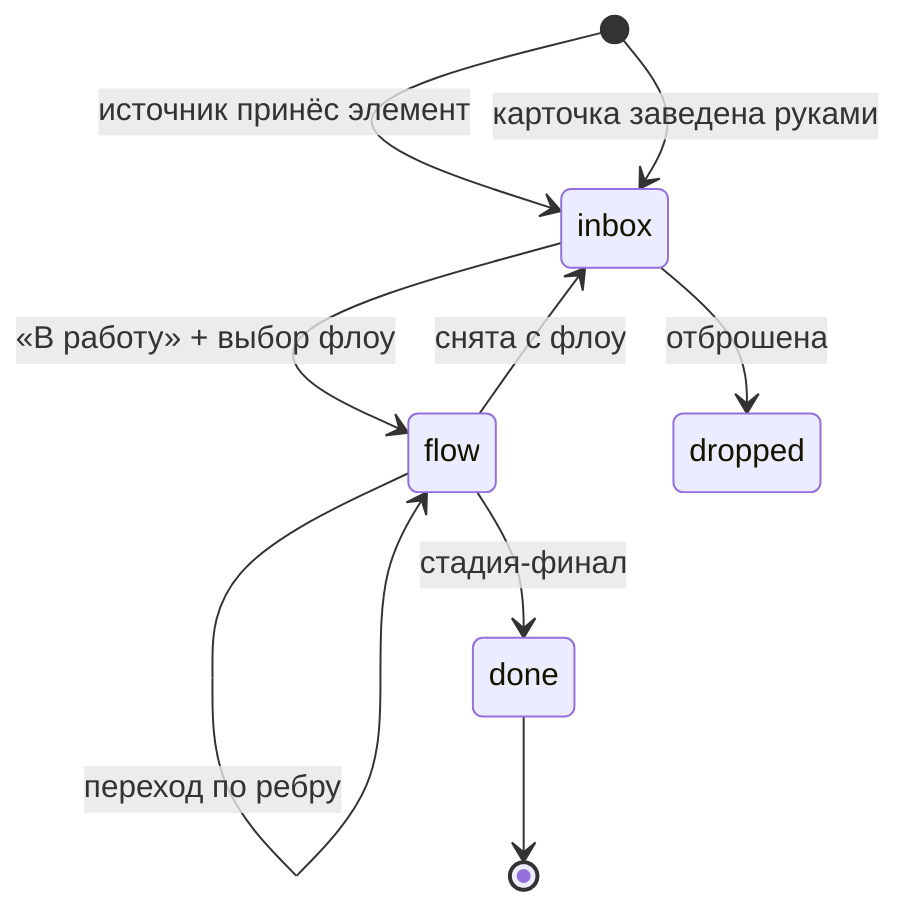
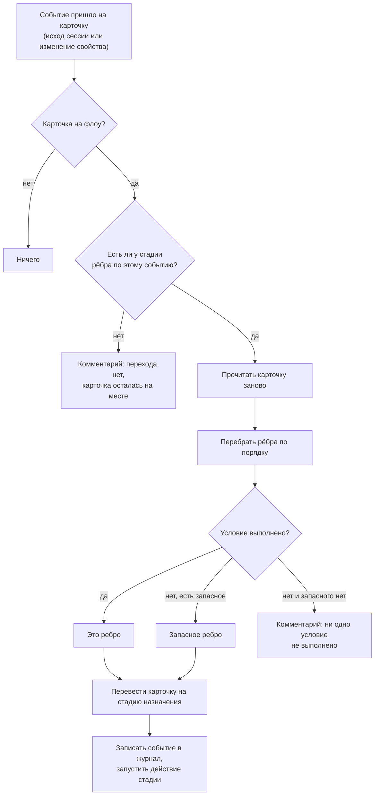
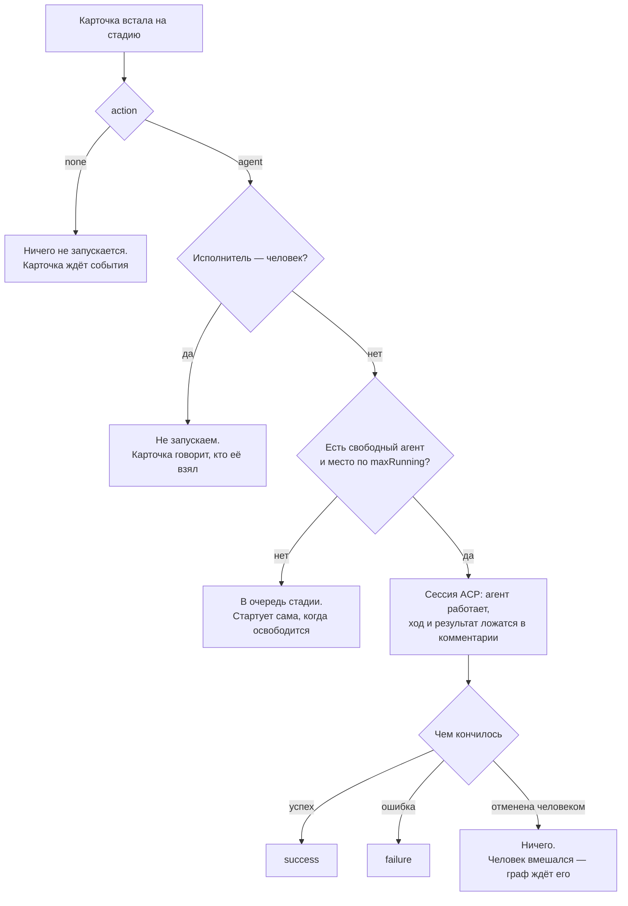

# Входящие → флоу

Формализация системы XXVI: как задача попадает в приложение, как она едет по
флоу, при каких условиях делается следующий шаг и какой агент подбирает её на
каждой стадии.

Документ написан до кода и остаётся местом, где записаны решения, а не
пересказом реализации. Смежный документ: [poc.md](poc.md) — что входит в первую
версию и что сознательно отложено.

## 1. Чем это отличается от XCIII

XCIII — это доска. Карточка живёт в колонке, колонка говорит, что с ней делать,
маршрут говорит, куда её двигать дальше. Три сущности на один вопрос: где
карточка, что с ней происходит и куда она поедет.

Здесь канбана нет. Остаются две вещи:

- **Входящие** — то, что принесли источники, сгруппированное по источникам;
- **Флоу** — маршрут, по которому едет взятая в работу карточка.

Из этого следует главное упрощение: **колонок нет, поведение переезжает на
стадию**. В XCIII стадия маршрута ссылалась на колонку доски, а колонка несла
действие, состав и лимит; там это было правильно, потому что доска существовала
и без маршрутов. Здесь стадия — единственное место, где карточка может стоять,
и разделять «где стоит» и «что делается» стало нечем. Стадия сама говорит, что
на ней происходит, кто её работает и сколько карточек одновременно.

Что остаётся из XCIII без изменений по смыслу: замкнутое множество триггеров,
условия на переходах (свойство карточки и слова агента), очередь на занятую
стадию, сигналы HITL, агенты по ACP.

## 2. Словарь

| Термин | Что это |
|---|---|
| **Источник** (source) | откуда приходят задачи: демо-файл, ingest с телефона, трекер. Запись реестра |
| **Элемент** (item) | единица данных источника: одно письмо, одно уведомление, один issue |
| **Правило** (rule) | что сделать с элементом: завести карточку, дописать комментарий, отбросить |
| **Карточка** (card) | единица работы. Заводится из элемента или руками |
| **Флоу** (flow) | именованный граф стадий и переходов |
| **Стадия** (stage) | узел флоу. Место, где карточка стоит, и работа, которая на ней делается |
| **Переход** (edge) | ребро: из какой стадии, по какому событию, в какую стадию, при каком условии |
| **Триггер** (trigger) | событие перехода. Множество замкнуто и реализовано в Go |
| **Условие** (condition) | вопрос о карточке на ребре. Не скрипт |
| **Агент** (agent) | зарегистрированный ACP-агент: claude, codex или произвольная ACP-команда |
| **Состав** (crew) | агенты, которым разрешено работать эту стадию |
| **Сессия** (session) | один запуск агента по одной карточке на одной стадии |
| **Вопрос** (question) | агент спросил человека и ждёт ответа (HITL) |

## 3. Жизнь карточки



Ровно четыре состояния: `inbox`, `flow`, `done`, `dropped`. Карточка в
состоянии `flow` всегда стоит на какой-то стадии — пары «на флоу, но нигде» не
существует, и это инвариант, а не соглашение.

Вход во флоу — **решение человека**: во входящих у карточки есть кнопка «В
работу», она спрашивает флоу и ставит карточку на его входную стадию. Правила
источника могут заполнить свойства карточки, но не могут запустить её по флоу
сами: PoC сознательно оставляет этот шаг человеку, чтобы «почему эта карточка
поехала» всегда имело ответ.

## 4. Флоу

Флоу — это граф:

```
Flow  = { name, description, entryStage, stages[], edges[] }
Stage = { id, name, action, prompt, crew[], maxRunning, final, x, y }
Edge  = { from, to, on, if? }
```

**Входная стадия** — та, на которую карточка встаёт при «В работу». Она одна и
задаётся явно: граф с циклами не имеет естественного начала, а угадывать его по
отсутствию входящих рёбер значит ломать флоу первым же обратным переходом.

**Финальная стадия** (`final`) — та, после которой карточка становится `done`.
Она ничего не делает и никуда не ведёт.

### 4.1. Что делает стадия

Действие стадии — замкнутое множество:

| `action` | Что происходит, когда карточка встаёт на стадию |
|---|---|
| `none` | ничего. Карточка стоит и ждёт события — обычно ответа человека |
| `agent` | запускается сессия ACP-агента с задачей карточки |

Двух действий достаточно, и третье пришлось бы придумывать. `deploy` и `test`
из XCIII были не действиями, а агентами с предустановленным промптом и особыми
правами; здесь это просто стадии с `action: agent`, своим промптом и своим
составом.

Стадия `none` — это не «пустая стадия», а **точка ожидания**. Именно на ней
живёт человеческая развилка: «Одобрено = Да» ведёт дальше, «Одобрено = Нет»
возвращает назад.

### 4.2. Промпт стадии

У стадии есть `prompt` — то, что говорится агенту помимо задачи карточки.
Итоговый промпт сессии складывается из трёх кусков, в этом порядке:

1. промпт агента (`agent.prompt`) — кто он вообще;
2. промпт стадии (`stage.prompt`) — что делается на этом шаге;
3. задача карточки — заголовок, текст, свойства, ссылка на источник.

Ничего из этого не обязательно, кроме третьего.

## 5. Переходы

### 5.1. Триггеры

Множество замкнуто и реализовано в Go. Конфигурация говорит, **что** с чем
соединено; **когда** — решает код. Ничто в конфигурации не интерпретируется как
скрипт.

| Триггер | Источник | Кто его производит |
|---|---|---|
| `success` | исход шага | сессия агента завершилась успешно |
| `failure` | исход шага | сессия агента упала или не запустилась |
| `card.changed` | человек | на карточке выставили значение свойства |

Третьего исхода — «агент не смог» — сознательно нет. Сессия заканчивается либо
успехом, либо падением, а агент, которому есть что добавить, говорит это своими
последними словами, и об этом можно спросить условием на ребре. Триггер, который
редактор предлагает, а движок никогда не производит, — это ловушка.

Ручной перевод карточки на другую стадию — не триггер и не ребро. Человек может
перенести карточку куда угодно в любой момент; работающая сессия при этом
отменяется, а новая стадия запускается так, как будто её привёл переход. Это то
же правило, что и в XCIII: человек всегда главнее графа.

Git- и GitHub-триггеров в PoC нет. Их место в модели предусмотрено — у триггера
есть поле `source`, и добавление `git`/`github` не меняет ни движок, ни
редактор, — но ничего, что требует поллинга внешнего мира, здесь пока не
работает.

### 5.2. Условия

Условие на ребре задаёт вопрос о карточке. Форм ровно две, и обе — вопрос, а не
вычисление:

- **`{ property, value }`** — у карточки свойство `property` имеет значение
  `value`. Так делается развилка: «Приоритет = срочный» ведёт мимо ревью,
  остальные — через;
- **`{ commentContains }`** — в финальном тексте агента есть подстрока. Так
  агент маршрутизирует карточку сам: попросите его закончить словами «ГОТОВО К
  ДЕПЛОЮ», и ветка с этим условием поедет, только когда он сам так решит.
  Возможно только на исходах шага — там, где агент вообще говорил.

Из одной стадии по одному событию может выходить **несколько** рёбер. Побеждает
первое, чьё условие выполнено; ребро без условия — запасной выход, и оно может
быть только одно на пару (стадия, событие). Два безусловных ребра по одному
событию редактор отказывается сохранять: непонятно, куда ехать.

Для `card.changed` условие обязательно и оно не охранник, а само событие:
«выставили `Одобрено` = `Да`» — это и есть то, чего стадия ждёт. Выставление
любого другого свойства не будит стадию и не оставляет следа: изменение просто
было адресовано не ей.

### 5.3. Как выбирается переход



Карточка читается заново перед выбором ребра: условие спрашивает о карточке
такой, какая она сейчас, а не какой была, когда встала на стадию. Одно событие
двигает карточку один раз — это гарантирует ключ идемпотентности
`flow|<card>|<stage>|<trigger>`.

## 6. Кто подбирает карточку

У стадии есть **состав** (`crew`) — список имён зарегистрированных агентов.
Состав это не назначение, а список допуска: он говорит, кому вообще разрешено
работать эту стадию, а карточка выбирает из них.

Порядок выбора:

1. **исполнитель карточки**, если он назван и входит в состав. Так человек
   говорит «эту задачу пусть делает вот этот агент»;
2. **первый свободный из состава** — в том порядке, в котором состав перечислен,
   поэтому выбор повторяем и первый в списке работает обычно;
3. если состав пуст — **единственный зарегистрированный агент**;
4. если состав пуст, а агентов несколько — это ошибка стадии, и она видна в
   редакторе, а не на карточке в момент запуска.

Если **исполнитель карточки — человек** (а не агент), агент не запускается
вовсе: карточка остаётся стоять и говорит, что её взял человек. Это не провал
шага — работа делается, просто не нами, — поэтому ребро `failure` не срабатывает.

Если **весь состав занят** или достигнут `maxRunning` стадии, карточка встаёт в
очередь этой стадии и стартует сама, как только освободится место. Очередь —
FIFO по времени постановки, одна на стадию. Это и есть WIP-лимит.



Отменённая сессия **не производит исхода**. Отмена значит, что вмешался человек,
и решать, куда карточка поедет дальше, — теперь его дело.

## 7. Сигналы и HITL

Агент останавливается и ждёт человека в двух случаях, и оба приходят по ACP:

- **`session/request_permission`** — агент хочет инструмент, которого нет в
  списке автоматически разрешённых;
- **elicitation** — агент хочет ответ словами или выбор из вариантов. Сюда же
  приходит `AskUserQuestion` у Claude: форма из одного свойства с `oneOf` и
  полем для своего текста рядом.

Обе формы нормализуются в одну сущность — **вопрос** (`Question`) — и
показываются одинаково: текст, варианты с пояснениями и поле для ответа своими
словами, если оно предложено.

Три вещи об ожидании, каждая из которых — решение, а не следствие:

- **ждёт только то, что спросило.** Агент продолжает работать над остальным, ход
  остаётся открытым, а карточка стоит на своей стадии и помечена как ждущая
  человека — не как сделанная;
- **ничего не решается таймером.** Вопрос без ответа считается отвеченным, когда
  сессию отменяют или приложение закрывают, и «нет ответа» приходит агенту как
  отказ. Он доканчивает работу без того, что просил, и комментарии карточки
  говорят, чего именно не хватило;
- **вопрос — это сигнал.** Карточка получает отметку, а сам вопрос уходит в
  нотификацию с вариантами на ней. Ответить можно и там, и на карточке: это один
  и тот же вопрос, и ответ на любой из них отпускает агента.

Сигнал уровня приложения — `Attention`: список всего, что ждёт человека, старшее
первым. Он один и тот же для панели уведомлений и для отметок на карточках,
чтобы не было двух бухгалтерий одного факта.

## 8. Что источник может, а чего не может

Источник приносит **элементы**. Что с ними делать, решают **правила**, и они
тоже не скрипт:

```
Rule  = { name, when: Match, then: card|comment|drop, props{}, suggestFlow?, assignee? }
Match = { title: regexp, body: regexp, labels: [], props: {name: regexp} }
```

`suggestFlow` и `assignee` — это подсказки, а не действия: они заполняют поля в
диалоге «В работу», но не открывают его и не запускают флоу. Правило может
сказать, чего оно ждёт; решает по-прежнему человек.

Правила перебираются по порядку, побеждает первое совпавшее; пустой `Match` —
это «всё подряд», поэтому правило-ловушка идёт последним. Элемент, не совпавший
ни с одним правилом, идёт во входящие — или отбрасывается, если источник помечен
как шумный (`noisy`): поток уведомлений — это в основном шум, и там правило
означает подписку, а всё остальное не нужно.

Повторный элемент не заводит вторую карточку: пара `(источник, externalID)`
уникальна, а `version` говорит, изменился ли он. Изменившийся элемент по
умолчанию дописывает комментарий к своей карточке.

Чего источник не может: **писать в чужие карточки** и **двигать карточку по
флоу**. Первое — потому что карточка принадлежит источнику, который её завёл;
второе — потому что вход во флоу это решение человека (§3).

## 9. Где что хранится

Всё в одной SQLite рядом с приложением. Реестры тоже: агенты, источники и флоу —
такие же строки, как карточки, и на них работают те же запросы.

Драйвер — `modernc.org/sqlite`: чистый Go, поэтому сборка не требует cgo и
кросс-компилируется. Поверх него `database/sql` и `sqlx` — тонкий слой ради
сканирования в структуры; SQL пишется руками. Конструктор запросов не берём:
единственный живой кандидат заморожен по фичам с 2023 года, а прятать за ним
десяток запросов дороже, чем их написать.

Второй диалект (Postgres) в PoC не поддерживается, но шов под него оставлен и
стоит недорого: запросы пишутся с `?`, а `sqlx.Rebind` переводит их в стиль
драйвера — для Postgres в `$N`. Всё, что кроме плейсхолдеров расходится между
диалектами, собрано в одном месте (`internal/store/dialect.go`): `UPSERT`,
автоинкремент и типы времени. Пока реализация одна — SQLite; добавление второй
означает вторую реализацию этого интерфейса, а не правки по всему хранилищу.

Миграции — версионированный список SQL-шагов, применяемых по порядку под
таблицей `schema_migration`. Библиотека не нужна: шагов немного, и они обязаны
быть читаемыми.

| Таблица | Что в ней |
|---|---|
| `source`, `source_rule` | реестр источников и их правила |
| `agent` | реестр ACP-агентов |
| `flow`, `stage`, `stage_agent`, `edge` | флоу целиком, в нормальном виде |
| `card`, `card_prop`, `card_comment` | карточки, их свойства и история |
| `card_flow`, `card_flow_visit` | где карточка стоит и где уже была |
| `flow_event` | журнал переходов: откуда, куда, по какому событию |
| `agent_session`, `session_event` | сессии агентов и их поток |
| `stage_queue` | кто ждёт места на стадии |
| `source_item` | что источник уже приносил |
| `idempotency` | одно событие двигает карточку один раз |
| `setting` | настройки машины: рабочая папка, лимит сессий, автодопуск инструментов |

Граф разложен по таблицам, а не лежит JSON-блобом, по одной причине: «где сейчас
карточки этого флоу» и «какие стадии ссылаются на этого агента» — это запросы, и
они должны быть запросами.

## 10. Что проверяется при сохранении флоу

Редактор проверяет весь граф целиком, перед тем как принять его, и отказывает
предложением, в котором сказано, что не так:

- у флоу есть имя, и оно не занято;
- есть хотя бы одна стадия и указана входная;
- у стадии есть имя, оно уникально внутри флоу, и действие из замкнутого
  множества;
- ребро ведёт из существующей стадии в существующую;
- событие ребра — из замкнутого множества;
- условие либо про свойство, либо про слова агента, но не про оба сразу, и не
  пустое;
- условие про слова агента возможно только на исходе шага;
- у `card.changed` условие обязательно;
- нет двух безусловных рёбер из одной стадии по одному событию;
- каждый агент состава есть в реестре;
- у стадии с `action: agent` и пустым составом реестр содержит ровно одного
  агента — иначе выбирать будет не из чего;
- финальная стадия не имеет исходящих рёбер.

Карточки, стоящие на стадии, которую убрали из флоу, не теряются: они остаются
на месте, а карточка говорит, что её стадия исчезла, и ждёт человека.
